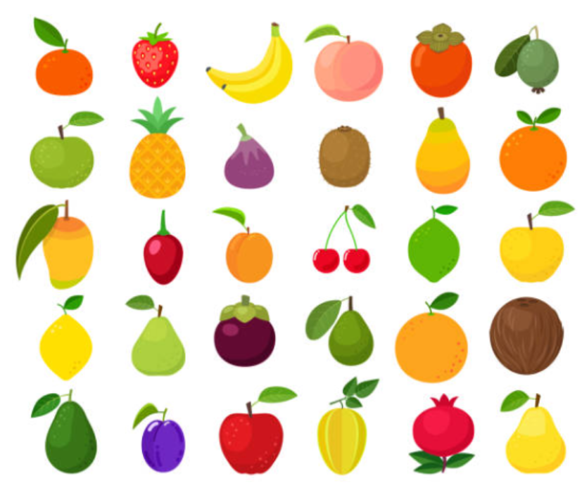
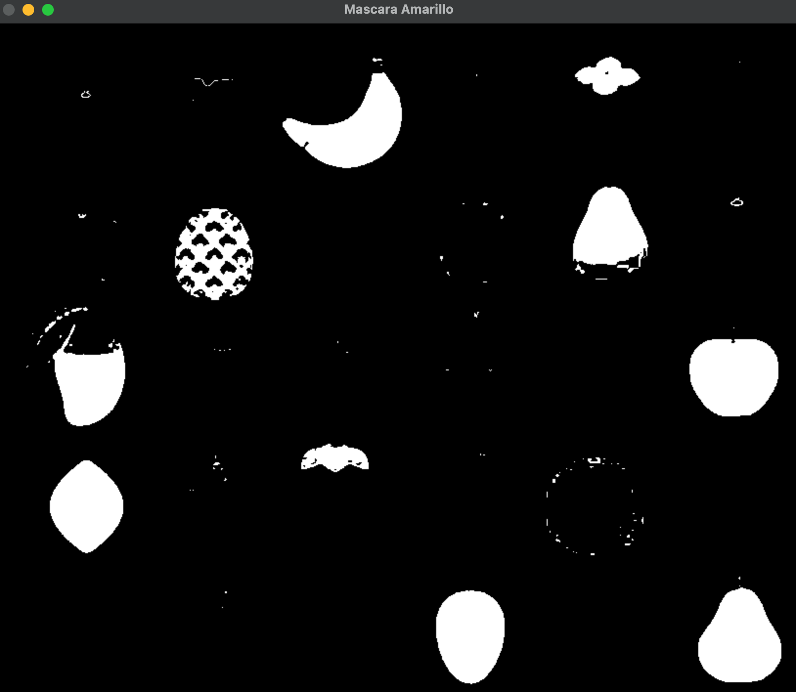
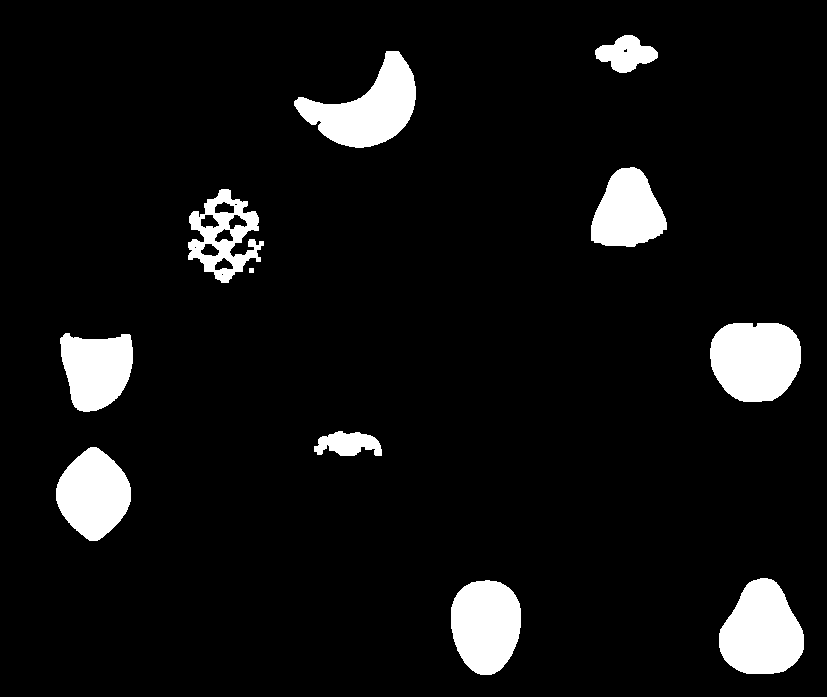

Segmentacion de frutas

Actividad 1: Exploración del Espacio HSV

Seleccionar un color (rojo, verde o amarillo).
Ajustar el rango HSV hasta que la máscara detecte únicamente las frutas de ese color.
Guardar capturas de:
Imagen original

Imagen en HSV
 6.35.57 p.m..png>)

Máscara obtenida

Reflexión:

¿Qué ocurre cuando el rango es muy estrecho?
Detecta sólo algunos píxeles del objeto y partes de la fruta desaparecen.

¿Qué ocurre cuando el rango es muy amplio?
Aparecen objetos que no pertenecen a la fruta y aumenta el ruido.

Actividad 2: Limpieza de Ruido

Analizar la máscara sin aplicar operaciones morfológicas.
Aplicar un método de limpieza (apertura o cierre).
Comparar ambas máscaras.

Codigo
import cv2
import numpy as np

img = cv2.imread("frutas.png")

hsv = cv2.cvtColor(img, cv2.COLOR_BGR2HSV)

lower = np.array([20, 100, 100])
upper = np.array([35, 255, 255])

mask = cv2.inRange(hsv, lower, upper)

kernel = np.ones((5,5), np.uint8)

mask_limpia = cv2.morphologyEx(
    mask,
    cv2.MORPH_OPEN,
    kernel
)

cv2.imwrite("original.png", img)
cv2.imwrite("hsv.png", hsv)
cv2.imwrite("mascara_original.png", mask)
cv2.imwrite("mascara_limpia.png", mask_limpia)

cv2.imshow("frutas original", img)
cv2.imshow("mascara original", mask)
cv2.imshow("Mascara Limpia", mask_limpia)

cv2.waitKey(0)
cv2.destroyAllWindows()

Nueva mascara

Responder:

¿Qué tipo de ruido aparece?

En la máscara binaria obtenida mediante segmentación HSV se observan pequeños píxeles y regiones blancas aisladas que no pertenecen realmente a las frutas amarillas. Este ruido es generado por variaciones de iluminación, reflejos, sombras y objetos del fondo que poseen tonalidades similares al rango de color seleccionado. También pueden aparecer pequeños huecos negros dentro de las regiones correspondientes a las frutas.

¿Por qué es necesario eliminarlo antes del conteo?

Es necesario eliminar el ruido porque las regiones pequeñas pueden ser identificadas erróneamente como objetos independientes durante el proceso de conteo de componentes conectados. Esto provoca que el número de frutas detectadas sea mayor al real. Además, los huecos o interrupciones dentro de una misma fruta pueden fragmentar una región en varias partes, alterando el cálculo de áreas y afectando la precisión de los resultados. Las operaciones morfológicas permiten obtener regiones más limpias y continuas, mejorando la exactitud del conteo y del análisis de las frutas segmentadas.

Comparación de máscaras

Máscara original

* Contiene puntos blancos aislados.
* Presenta pequeñas imperfecciones en los bordes de las frutas.
* Puede generar falsos positivos durante el conteo.

Máscara después de la apertura morfológica

* Se eliminan las regiones pequeñas de ruido.
* Los objetos principales permanecen conservados.
* Facilita la identificación correcta de las frutas y el cálculo de sus áreas.

Actividad 3: Conteo de Regiones

Identificar cuántas regiones conectadas existen en la máscara.
Filtrar regiones pequeñas (ruido).
Codigo:
import cv2
import numpy as np

img = cv2.imread("frutas.png")
hsv = cv2.cvtColor(img, cv2.COLOR_BGR2HSV)

lower = np.array([20, 100, 100])
upper = np.array([35, 255, 255])

mask = cv2.inRange(hsv, lower, upper)

kernel = np.ones((5,5), np.uint8)
mask_limpia = cv2.morphologyEx(mask, cv2.MORPH_OPEN, kernel)

num_labels, labels, stats, centroids = cv2.connectedComponentsWithStats(mask_limpia)

area_minima = 500

contador = 0

print("Áreas de regiones válidas:")

for i in range(1, num_labels):  # 0 es el fondo
    area = stats[i, cv2.CC_STAT_AREA]

    if area > area_minima:
        contador += 1
        print(f"Fruta {contador}: {area} pixeles")

print("\nTotal de frutas detectadas:", contador)

cv2.imshow("Mascara limpia", mask_limpia)
cv2.waitKey(0)
cv2.destroyAllWindows()

Reportar:
Número total de frutas detectadas.
Total de frutas detectadas: 10

Área aproximada de cada región válida.
Fruta 1: 1433 pixeles
Fruta 2: 5832 pixeles
Fruta 3: 4275 pixeles
Fruta 4: 3267 pixeles
Fruta 5: 5968 pixeles
Fruta 6: 4384 pixeles
Fruta 7: 1169 pixeles
Fruta 8: 4918 pixeles
Fruta 9: 5960 pixeles
Fruta 10: 5282 pixeles

No se permite usar la imagen original para validar visualmente. El análisis debe hacerse únicamente observando la máscara.

Actividad 4.
Repetir el proceso para:

Frutas rojas
Codigo:
import cv2
import numpy as np

img = cv2.imread("frutas.png")
hsv = cv2.cvtColor(img, cv2.COLOR_BGR2HSV)

lower1 = np.array([0, 100, 100])
upper1 = np.array([10, 255, 255])

lower2 = np.array([160, 100, 100])
upper2 = np.array([180, 255, 255])

mask1 = cv2.inRange(hsv, lower1, upper1)
mask2 = cv2.inRange(hsv, lower2, upper2)

mask = cv2.bitwise_or(mask1, mask2)

kernel = np.ones((5,5), np.uint8)
mask_limpia = cv2.morphologyEx(mask, cv2.MORPH_OPEN, kernel)

num_labels, labels, stats, centroids = cv2.connectedComponentsWithStats(mask_limpia)

area_minima = 500
contador = 0

for i in range(1, num_labels):
    area = stats[i, cv2.CC_STAT_AREA]
    if area > area_minima:
        contador += 1
        print("Fruta roja", contador, area)

print("Total rojas:", contador)

cv2.imshow("Mascara Roja", mask_limpia)
cv2.waitKey(0)
cv2.destroyAllWindows()

Frutas verdes
codigo:
import cv2
import numpy as np

img = cv2.imread("frutas.png")
hsv = cv2.cvtColor(img, cv2.COLOR_BGR2HSV)

lower = np.array([35, 80, 80])
upper = np.array([85, 255, 255])

mask = cv2.inRange(hsv, lower, upper)

kernel = np.ones((5,5), np.uint8)
mask_limpia = cv2.morphologyEx(mask, cv2.MORPH_OPEN, kernel)

num_labels, labels, stats, centroids = cv2.connectedComponentsWithStats(mask_limpia)

area_minima = 500
contador = 0

for i in range(1, num_labels):
    area = stats[i, cv2.CC_STAT_AREA]
    if area > area_minima:
        contador += 1
        print("Fruta verde", contador, area)

print("Total verdes:", contador)

cv2.imshow("Mascara Verde", mask_limpia)
cv2.waitKey(0)
cv2.destroyAllWindows()

Frutas amarillas
Codigo:
import cv2
import numpy as np

img = cv2.imread("frutas.png")
hsv = cv2.cvtColor(img, cv2.COLOR_BGR2HSV)

lower = np.array([20, 100, 100])
upper = np.array([35, 255, 255])

mask = cv2.inRange(hsv, lower, upper)

kernel = np.ones((5,5), np.uint8)
mask_limpia = cv2.morphologyEx(mask, cv2.MORPH_OPEN, kernel)

num_labels, labels, stats, centroids = cv2.connectedComponentsWithStats(mask_limpia)

area_minima = 500
contador = 0

for i in range(1, num_labels):
    area = stats[i, cv2.CC_STAT_AREA]
    if area > area_minima:
        contador += 1
        print("Fruta amarilla", contador, area)

print("Total amarillas:", contador)

cv2.imshow("Mascara Amarilla", mask_limpia)
cv2.waitKey(0)
cv2.destroyAllWindows()

Construir una tabla comparativa:

Color	   Número Detectado	   Observaciones
amarillo      10.              Agarro colores naranja
verde         25               Esta contando tambien hojas
rojo.         8.               Agarro un color naranja

Preguntas:

Qué color fue más fácil segmentar?
El color más fácil de segmentar suele ser el amarillo o el verde, debido a que tienen un rango HSV más estable y suelen contrastar mejor con el fondo en imágenes de frutas. Esto permite una máscara más limpia y con menos falsos positivos.

¿Cuál presentó más ruido?
Generalmente el color rojo presenta más ruido, ya que en el espacio HSV el rojo se encuentra en dos zonas diferentes del espectro de tono (H), lo que complica su segmentación. Además, puede confundirse con sombras o tonos oscuros.

¿Por qué ocurre esto?

Esto ocurre porque:
* El espacio HSV no distribuye los colores de forma uniforme perceptualmente.
* El rojo está dividido en dos rangos de H (cerca de 0 y cerca de 180).
* La iluminación afecta el canal V (brillo), generando variaciones en la detección.
* Algunos objetos del fondo pueden tener tonos similares, generando falsos positivos.

Conclusión breve de la actividad
La segmentación por color en HSV es efectiva, pero su rendimiento depende fuertemente del color elegido y las condiciones de iluminación. Colores como el verde y el amarillo tienden a ser más estables, mientras que el rojo requiere ajustes más precisos debido a su comportamiento en el espacio de color. La limpieza con operaciones morfológicas es esencial para mejorar la precisión del conteo.

Actividad 5: Análisis Crítico

Responder de manera argumentada:

¿Por qué HSV es más adecuado que RGB para esta tarea?
El espacio de color HSV es más adecuado que RGB para segmentación de objetos porque separa la información de color en tres componentes independientes: tono (H), saturación (S) e intensidad (V). En cambio, en RGB los colores están mezclados en tres canales que dependen fuertemente de la iluminación. Esto hace que en HSV sea más fácil definir rangos de color específicos (por ejemplo, “amarillo” o “verde”) sin verse tan afectado por cambios de brillo o sombras.

¿Cómo afecta la iluminación al canal V?
El canal V representa el brillo o intensidad de la imagen. Cuando la iluminación cambia, este canal varía directamente, haciendo que un mismo objeto pueda verse más claro u oscuro. Esto puede provocar que algunos píxeles salgan del rango definido en la segmentación, generando errores como pérdida de detección o aparición de ruido. Por ejemplo, una fruta en sombra puede no ser detectada correctamente aunque su color sea el correcto.

¿Qué sucede si dos frutas tienen tonos similares?
Si dos frutas tienen tonos similares en el espacio HSV, pueden ser clasificadas como el mismo objeto durante la segmentación. Esto provoca que se fusionen regiones o que el algoritmo no pueda distinguir entre ellas. Como resultado, el conteo de regiones puede ser incorrecto y las frutas pueden aparecer como una sola región conectada.

¿Qué limitaciones tiene la segmentación por color?
La segmentación por color presenta varias limitaciones importantes:
* Es sensible a cambios de iluminación y sombras.
* No distingue objetos con colores similares aunque sean diferentes físicamente.
* Puede generar falsos positivos cuando el fondo tiene colores parecidos al objeto.
* Requiere ajustar manualmente los rangos HSV para cada caso.
* No considera forma, textura o contexto del objeto.

Conclusión final de la actividad
La segmentación por color en HSV es una técnica sencilla y eficiente para detectar objetos cuando las condiciones son controladas. Sin embargo, su desempeño depende fuertemente de la iluminación y de la separación de colores en la escena. Aunque permite una implementación rápida, presenta limitaciones importantes en entornos reales donde los colores no son uniformes y existen variaciones de luz, sombras y ruido visual. Por ello, suele complementarse con técnicas más avanzadas como detección por características o aprendizaje automático.

