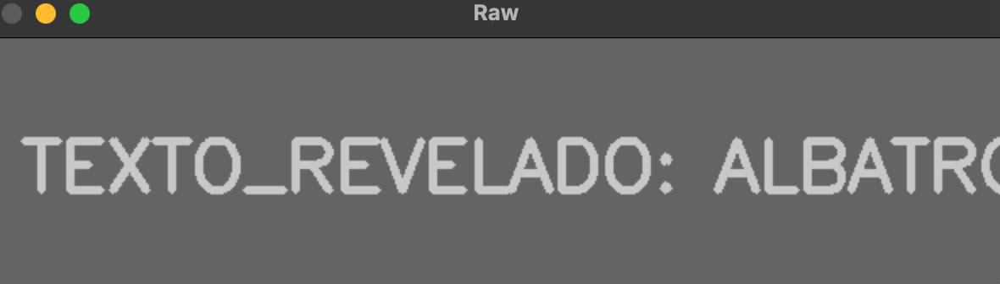
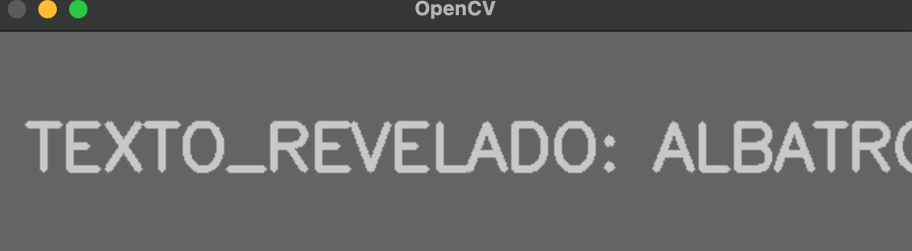
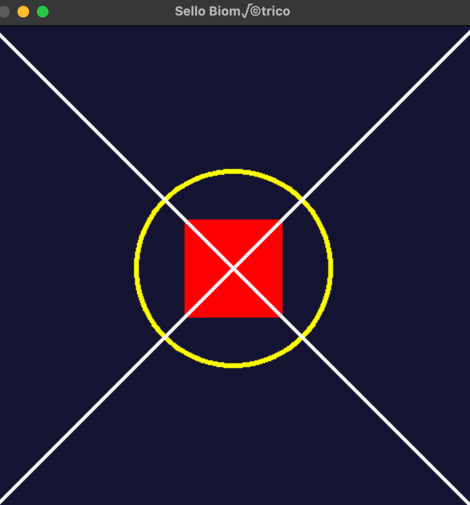
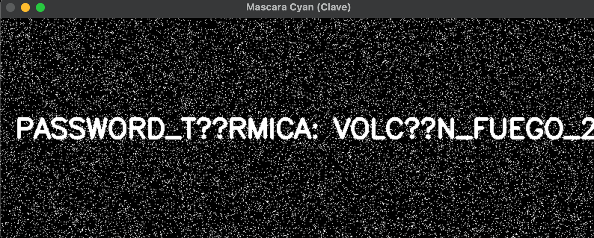
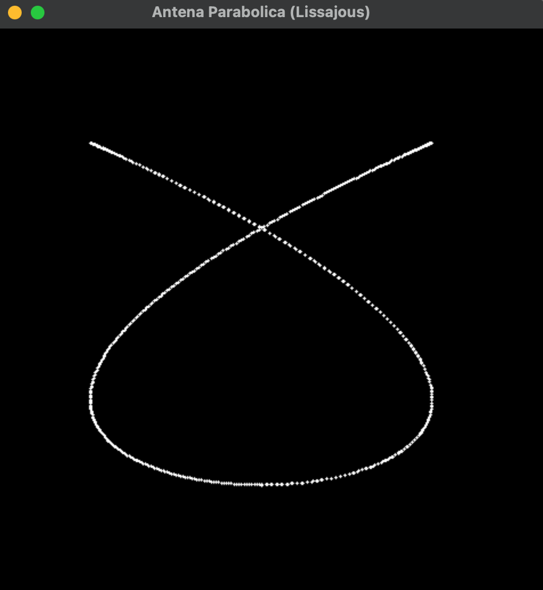

Operación Espejismo (Graficación Táctica Examen)

MISTICA CITLALI MOJICA RODRIGUEZ            24120409

Introducción a la Misión
Agentes, hemos interceptado los sistemas de comunicación visual de una célula enemiga. Han fragmentado sus contraseñas, ofuscado sus planos y ocultado sus trayectorias satelitales utilizando matemáticas de graficación. Su misión es aplicar sus conocimientos en operadores espaciales, color y geometría para recuperar la información.

Misión 1: El Mensaje Subexpuesto (Operadores Puntuales)

La Historia
Interceptamos una imagen (m1_oscura.png) que a simple vista parece un simple recuadro negro. Sin embargo, nuestros analistas detectaron que la imagen no está vacía; el enemigo aplicó un operador puntual de división para oscurecer los píxeles a niveles casi imperceptibles (valores entre 1 y 5).

Tu Tarea
Modo Raw: Usa ciclos anidados para recorrer la matriz y multiplicar cada píxel por 50. ¡Cuidado con superar el valor 255 (usa np.clip)!
Modo OpenCV / NumPy: Usa operaciones vectorizadas directas (cv2.multiply o img * 50).

MODO RAW
Codigo:
import cv2
import numpy as np

img = cv2.imread('m1_oscura.png', cv2.IMREAD_GRAYSCALE)

h, w = img.shape
result = np.zeros((h, w), dtype=np.uint8)

for i in range(h):
    for j in range(w):
        value = img[i, j] * 50
        result[i, j] = np.clip(value, 0, 255)

cv2.imshow("Raw", result)
cv2.waitKey(0)
cv2.destroyAllWindows()

Resultado:

MODO OPENCV/NUMPY
Codigo:
import cv2
import numpy as np

img = cv2.imread('m1_oscura.png', cv2.IMREAD_GRAYSCALE)

result = cv2.multiply(img, 50)
result = np.clip(result, 0, 255).astype(np.uint8)

cv2.imshow("OpenCV", result)
cv2.waitKey(0)
cv2.destroyAllWindows()

Resultado:

Conclusión de la misión

El operador puntual permite modificar imágenes de forma directa sobre cada píxel.
La operación inversa nos permite recuperar información oculta, demostrando cómo transformaciones matemáticas simples pueden ocultar o revelar datos visuales.

Conclusión General de la Operación

A lo largo de las misiones, se aplicaron técnicas fundamentales de visión por computadora:
* Segmentación por color (HSV)
* Operadores morfológicos para limpieza de ruido
* Conteo de regiones conectadas
* Transformaciones geométricas (traslación, rotación, escalamiento)
* Operadores puntuales en imágenes

Se comprobó que:
* OpenCV es significativamente más eficiente que implementaciones manuales.
* HSV es más robusto para segmentación por color.
* Las transformaciones geométricas dependen fuertemente de la interpolación.
* El procesamiento de imágenes es una combinación de matemáticas y optimización computacional.

Misión 2: El QR Fragmentado (Transformaciones Geométricas)

La Historia
Encontramos un código QR de acceso, pero el enemigo lo dividió en dos archivos y alteró su geometría para que no pueda ser escaneado.

La mitad superior (m2_mitad1.png) fue desplazada.
La mitad inferior (m2_mitad2.png) fue rotada 180 grados.

Las Pistas
Crea un lienzo en blanco (np.zeros) de 400x400 píxeles.
La mitad 1 debe ser trasladada al origen (0,0).
La mitad 2 debe ser rotada 180 grados sobre su propio centro y colocada en la parte inferior del lienzo.

Tu Tarea
Aplica matrices de traslación y rotación usando cv2.warpAffine para enderezar ambas piezas y unirlas en el lienzo final para revelar el código QR completo.

codigo:
import cv2
import numpy as np
mitad1 = cv2.imread("m2_mitad1.png")
mitad2 = cv2.imread("m2_mitad2.png")
if mitad1 is None or mitad2 is None:
    print("Error: no se pudieron cargar las imágenes")
    exit()
canvas = np.zeros((400, 400, 3), dtype=np.uint8)
h1, w1 = mitad1.shape[:2]
M1 = np.float32([
    [1, 0, 0],
    [0, 1, 0]
])
mitad1_shift = cv2.warpAffine(mitad1, M1, (400, 400))
canvas[0:h1, 0:w1] = mitad1_shift
h2, w2 = mitad2.shape[:2]
center = (w2 // 2, h2 // 2)
M2 = cv2.getRotationMatrix2D(center, 180, 1.0)
mitad2_rot = cv2.warpAffine(mitad2, M2, (w2, h2))
canvas[200:200 + h2, 0:w2] = mitad2_rot
cv2.imshow("QR Reconstruido", canvas)
cv2.waitKey(0)
cv2.destroyAllWindows()

Misión 3: El Sello Biométrico (Primitivas de Dibujo)

La Historia
El servidor principal requiere un "sello geométrico" exacto para abrirse. No tenemos la imagen del sello, solo las instrucciones en texto que el ingeniero de seguridad dejó anotadas. Debes dibujar el sello exacto desde cero.

Las Pistas (Instrucciones del Sello)
El lienzo debe ser azul oscuro BGR(50, 20, 20) de 500x500.
Dibuja un círculo amarillo central en (250, 250) con radio de 100, grosor 3.
Dibuja un rectángulo rojo sólido (relleno) que vaya de (200, 200) a (300, 300).
Traza dos líneas blancas diagonales cruzando todo el lienzo de esquina a esquina (formando una 'X' gigante) con grosor 2.

Tu Tarea
Utiliza las primitivas cv2.circle, cv2.rectangle y cv2.line para construir el sello y guardarlo como m3_sello_forjado.png.

Codigo:
import cv2
import numpy as np
img = np.full((500, 500, 3), (50, 20, 20), dtype=np.uint8)  # BGR
cv2.circle(
    img,
    (250, 250),      # centro
    100,             # radio
    (0, 255, 255),   # amarillo (BGR)
    3                # grosor
)
cv2.rectangle(
    img,
    (200, 200),      # esquina superior izquierda
    (300, 300),      # esquina inferior derecha
    (0, 0, 255),     # rojo (BGR)
    -1               # relleno
)
cv2.line(
    img,
    (0, 0),
    (500, 500),
    (255, 255, 255),  # blanco
    2
)
cv2.line(
    img,
    (500, 0),
    (0, 500),
    (255, 255, 255),
    2
)
cv2.imwrite("m3_sello_forjado.png", img)
cv2.imshow("Sello Biométrico", img)
cv2.waitKey(0)
cv2.destroyAllWindows()

resultado:

Misión 4: La Frecuencia Térmica (Modelo HSV)

La Historia
El enemigo ocultó la contraseña de desactivación dentro de un mapa de ruido visual (m4_ruido.png). A simple vista es un desastre de colores estáticos, pero inteligencia indica que el mensaje está escrito en una frecuencia de color puramente Cyan (Celeste).

Las Pistas
El modelo HSV nos permite aislar colores puros sin importar mucho su iluminación.
En OpenCV, el color Cyan tiene un Matiz (Hue) cercano a 90.
Rango sugerido -> Bajo: [80, 100, 100], Alto: [100, 255, 255].

Tu Tarea
Convierte la imagen a HSV, aplica cv2.inRange con los límites sugeridos y muestra la máscara binaria resultante. ¡El ruido desaparecerá y la contraseña se revelará!

Codigo:
import cv2
import numpy as np
img = cv2.imread("m4_ruido.png")
if img is None:
    print("Error: no se pudo cargar la imagen")
    exit()
hsv = cv2.cvtColor(img, cv2.COLOR_BGR2HSV)
lower_cyan = np.array([80, 100, 100])
upper_cyan = np.array([100, 255, 255])
mask = cv2.inRange(hsv, lower_cyan, upper_cyan)
cv2.imshow("Imagen Original", img)
cv2.imshow("Mascara Cyan (Clave)", mask)
cv2.waitKey(0)
cv2.destroyAllWindows()

resultado:

Misión 5: La Antena Parabólica (Ecuaciones Paramétricas)

La Historia
Necesitamos calibrar nuestro láser para destruir la antena enemiga. No tenemos la forma de la antena, pero interceptamos su ecuación paramétrica generadora (Una Curva de Lissajous). Si la graficamos, sabremos a qué le estamos disparando.

Las Pistas
Las ecuaciones paramétricas calculan  en función de un parámetro de tiempo :
Evalúa  desde  hasta  () en pequeños pasos (ej. saltos de 0.01).

Tu Tarea
Crea un lienzo negro de 500x500. Usa un ciclo for o while para ir incrementando . En cada paso, calcula e  (recuerda convertirlos a enteros) y dibuja un pequeño círculo o un punto blanco en esas coordenadas. ¡Al terminar el ciclo, verás el rastro de la forma geométrica secreta!

Codigo:
import cv2
import numpy as np
import math
img = np.zeros((500, 500, 3), dtype=np.uint8)
t = 0.0
step = 0.01
a = 3
b = 2
while t <= 2 * math.pi:
    # ecuaciones paramétricas
    x = int(250 + 150 * math.sin(a * t))
    y = int(250 + 150 * math.cos(b * t))
    # dibujar punto
    cv2.circle(img, (x, y), 1, (255, 255, 255), -1)
    t += step
cv2.imshow("Antena Parabolica (Lissajous)", img)
cv2.waitKey(0)
cv2.destroyAllWindows()

resultado:

Análisis General de las Misiones

Misión 1: Operadores Puntuales (Imagen Oculta)

Análisis
En esta misión se aplicó un operador puntual multiplicativo para recuperar información visual que había sido oscurecida intencionalmente.
Cada píxel fue modificado de forma independiente, lo que demuestra que:
* Las transformaciones puntuales no dependen del contexto espacial.
* La imagen puede recuperarse aplicando la operación inversa.

Interpretación
El uso de multiplicación permitió reconstruir la intensidad original de la imagen, evidenciando que la información no estaba perdida, solo transformada.

Limitación
Si los valores exceden 255, ocurre saturación, lo que puede provocar pérdida de detalle.

Misión 2: Transformaciones Geométricas (QR Fragmentado)

Análisis
Se utilizaron transformaciones geométricas:
* Traslación
* Rotación
Estas permiten modificar la posición y orientación de una imagen sin alterar su contenido interno.

Interpretación
La reconstrucción del QR demuestra que:
* La información visual puede fragmentarse sin destruirse.
* El orden espacial es crítico para la lectura de patrones (como QR).

Limitación
Pequeños errores en rotación o alineación pueden impedir la decodificación del código.

Misión 3: Primitivas de Dibujo (Sello Biométrico)

Análisis
Se construyó una imagen completamente desde cero utilizando:
* Círculos
* Rectángulos
* Líneas
Esto demuestra el uso de geometría básica en gráficos computacionales.

Interpretación
Las primitivas permiten generar estructuras complejas sin necesidad de imágenes externas.

Limitación
No hay realismo visual, ya que depende solo de formas básicas sin textura ni profundidad.

Misión 4: Segmentación HSV (Frecuencia Térmica)

Análisis
Se utilizó el modelo HSV para aislar un color específico dentro de una imagen ruidosa.
Esto demuestra que:
* HSV separa mejor la información de color que RGB
* El canal Hue es clave para segmentación

Interpretación
El filtrado por rango permite extraer información oculta incluso en entornos con ruido visual.

Limitación
La iluminación y variaciones de color pueden afectar la precisión del filtrado.

Misión 5: Ecuaciones Paramétricas (Antena Lissajous)

Análisis
Se generó una figura geométrica mediante funciones trigonométricas dependientes del tiempo.
Esto muestra que:
* La geometría puede ser descrita matemáticamente
* Las curvas complejas se forman a partir de funciones simples

Interpretación
Las ecuaciones paramétricas permiten modelar trayectorias físicas reales como ondas, antenas o señales.

Limitación
Dependiendo del paso de muestreo, la figura puede perder suavidad o precisión.

Conclusión General
Las cinco misiones demuestran distintos pilares fundamentales de la visión por computadora:
* Transformaciones matemáticas de píxeles
* Geometría computacional
* Construcción de imágenes desde primitivas
* Segmentación por color en espacios perceptuales
* Modelado de curvas mediante ecuaciones paramétricas

 Conclusión final
La visión por computadora no solo se basa en imágenes, sino en matemáticas aplicadas: álgebra lineal, trigonometría, estadística y teoría de señales.
Cada misión muestra cómo la información visual puede ser manipulada, reconstruida o interpretada mediante operaciones matemáticas precisas.

