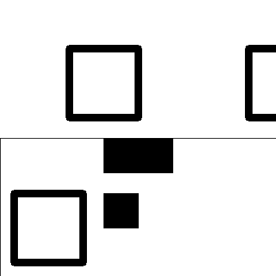
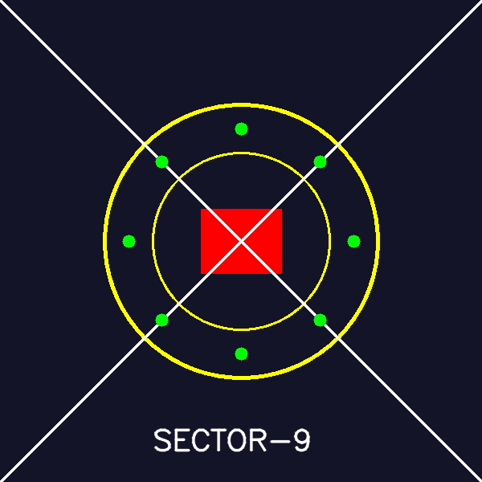
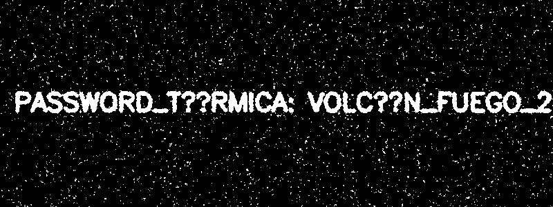
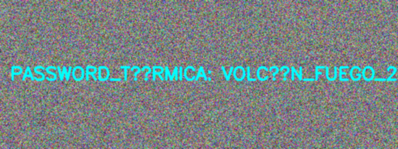
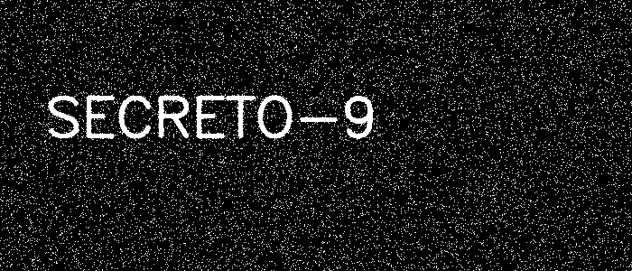

Operación Espejismo II (Graficación Táctica Examen)

Introducción a la Misión
Agentes, hemos interceptado un paquete de evidencias visuales. El enemigo está usando graficación 2D para fragmentar claves, camuflar mensajes y alterar geometría.

Reglas:
Si trabajas en escala de grises, mantén el rango en 0..255.
Siempre que multipliques o sumes intensidades, usa saturación: np.clip(..., 0, 255).
Entrega imágenes (PNG) y tu reporte final en Markdown.

Archivos base (en esta misma carpeta):
m1_oscura.png
m2_mitad1.png
m2_mitad2.png
m4_ruido.png

Misión 1: El Mensaje Subexpuesto II (Operadores Puntuales en 2 fases)

La Historia
Interceptamos una imagen (m1_oscura.png) casi negra. Pero ahora el enemigo aplicó dos etapas:
División (para “apagar” el texto).
Resta de un sesgo pequeño (para que, al recuperar, se “queme” si no saturas).

Las Pistas
Recuperación sugerida:
Paso A: multiplicar por 50
Paso B: sumar una constante (ej. 15 o 25)
Saturar a 0..255

Tu Tarea
Modo Raw: usa ciclos anidados para recuperar: multiplicar por 50 y luego sumar +20 (con saturación).
Modo NumPy/OpenCV: haz lo mismo pero vectorizado (img*50 + 20 o cv2.multiply + cv2.add).
Guarda dos evidencias:
m1_recuperado_x50.png
m1_recuperado_x50_mas20.png

MODO RAW
Codigo:
import cv2
import numpy as np
img = cv2.imread("m1_oscura.png", cv2.IMREAD_GRAYSCALE)
if img is None:
    print("Error al cargar imagen")
    exit()
h, w = img.shape
recuperada = np.zeros((h, w), dtype=np.int32)
for i in range(h):
    for j in range(w):
        recuperada[i, j] = img[i, j] * 50
recuperada = np.clip(recuperada, 0, 255).astype(np.uint8)
cv2.imwrite("m1_recuperado_x50.png", recuperada)
recuperada2 = np.zeros((h, w), dtype=np.int32)
for i in range(h):
    for j in range(w):
        recuperada2[i, j] = recuperada[i, j] + 20
recuperada2 = np.clip(recuperada2, 0, 255).astype(np.uint8)
cv2.imwrite("m1_recuperado_x50_mas20.png", recuperada2)
print("Procesamiento RAW completado")

resultado:

Modo NumPy/OpenCV
Codigo:
import cv2
import numpy as np
img = cv2.imread("m1_oscura.png", cv2.IMREAD_GRAYSCALE)
if img is None:
    print("Error al cargar imagen")
    exit()
recuperada = cv2.multiply(img, 50)
recuperada = np.clip(recuperada, 0, 255).astype(np.uint8)
cv2.imwrite("m1_recuperado_x50.png", recuperada)
recuperada2 = cv2.add(recuperada, 20)
cv2.imwrite("m1_recuperado_x50_mas20.png", recuperada2)
print("Procesamiento vectorizado completado")

resultados:

Misión 2: El QR Fragmentado II (Traslación + Rotación + Ensamble)

La Historia
El QR sigue partido:

La mitad superior (m2_mitad1.png) fue desplazada.
La mitad inferior (m2_mitad2.png) fue rotada 180°.
Pero ahora debes ensamblarlo con precisión, dejando el código centrado en el lienzo final.

Las Pistas
Crea un lienzo blanco de 400x400.
Corrige:
Mitad 1: traslación inversa hacia el origen.
Mitad 2: rotación inversa 180° sobre su centro y colocación en la parte inferior.

Tu Tarea
Crea lienzo blanco 400x400 (3 canales).
Endereza ambas piezas con cv2.warpAffine.
Pega las piezas (sin solaparlas) para reconstruir el QR.
Guarda: m2_qr_reconstruido.png

Codigo:

import cv2
import numpy as np
mitad1 = cv2.imread("m2_mitad1.png")
mitad2 = cv2.imread("m2_mitad2.png")
if mitad1 is None or mitad2 is None:
    raise FileNotFoundError("No se encontraron las imágenes m2_mitad1.png o m2_mitad2.png")
lienzo = np.full((400, 400, 3), 255, dtype=np.uint8)
h1, w1 = mitad1.shape[:2]
h2, w2 = mitad2.shape[:2]
dx1, dy1 = 0, 0
M1 = np.float32([
    [1, 0, dx1],
    [0, 1, dy1]
])
mitad1_corr = cv2.warpAffine(mitad1, M1, (w1, h1))
lienzo[0:h1, 0:w1] = mitad1_corr
center = (w2 // 2, h2 // 2)
M2 = cv2.getRotationMatrix2D(center, 180, 1.0)
mitad2_rot = cv2.warpAffine(mitad2, M2, (w2, h2))
y_offset = 400 - h2
lienzo[y_offset:y_offset + h2, 0:w2] = mitad2_rot
cv2.imwrite("m2_qr_reconstruido.png", lienzo)
cv2.imshow("QR reconstruido", lienzo)
cv2.waitKey(0)
cv2.destroyAllWindows()

resultado:

Misión 3: El Sello Biométrico II (Primitivas + Simetría)

La Historia
El servidor principal requiere un sello geométrico, pero ahora incluye patrones simétricos y una marca de autenticidad.

Instrucciones del Sello
Lienzo: 600x600 color base BGR(40, 20, 20).
Círculo central amarillo en (300, 300) radio 170 grosor 3.
Círculo interior amarillo en (300, 300) radio 110 grosor 2.
Rectángulo rojo sólido (relleno) de (250, 260) a (350, 340).
Dos líneas blancas diagonales de esquina a esquina (una X) grosor 2.
Marca simétrica: coloca 8 círculos verdes pequeños (radio 8, rellenos) alrededor del centro, a 140 px de distancia (tipo brújula).
Texto blanco: SECTOR-9 centrado abajo (aprox y=560).

Tu Tarea
Dibuja el sello EXACTAMENTE en ese orden.
Guarda: m3_sello_forjado_v2.png

codigo:

import cv2
import numpy as np
import math
img = np.zeros((600, 600, 3), dtype=np.uint8)
img[:] = (40, 20, 20)
cx, cy = 300, 300
cv2.circle(img, (cx, cy), 170, (0, 255, 255), 3)
cv2.circle(img, (cx, cy), 110, (0, 255, 255), 2)
cv2.rectangle(img, (250, 260), (350, 340), (0, 0, 255), -1)
cv2.line(img, (0, 0), (600, 600), (255, 255, 255), 2)
cv2.line(img, (600, 0), (0, 600), (255, 255, 255), 2)
radius = 140
for i in range(8):
    angle = math.radians(i * 45)
    x = int(cx + radius * math.cos(angle))
    y = int(cy + radius * math.sin(angle))
    cv2.circle(img, (x, y), 8, (0, 255, 0), -1)
cv2.putText(
    img,
    "SECTOR-9",
    (190, 560),
    cv2.FONT_HERSHEY_SIMPLEX,
    1.2,
    (255, 255, 255),
    2,
    cv2.LINE_AA
)
cv2.imwrite("m3_sello_forjado_v2.png", img)
cv2.imshow("Sello Biométrico V2", img)
cv2.waitKey(0)
cv2.destroyAllWindows()

resultados:

Misión 4: La Frecuencia Térmica II (HSV + máscara + “limpieza” por convolución)

La Historia
El enemigo ocultó la contraseña en (m4_ruido.png), pero ahora hay ruido extra que genera falsos positivos en la máscara.

Las Pistas
Segmentar Cyan en HSV (Hue ~ 90).
Antes de segmentar, puedes suavizar con un kernel de promedio para reducir ruido:
Kernel promedio 3x3: [[1,1,1], [1,1,1], [1,1,1]] / 9

Tu Tarea
Aplica un filtro por convolución (promedio 3x3) a la imagen BGR.
Convierte a HSV.
Segmenta con cv2.inRange usando un rango Cyan.

Guarda:
m4_mask_cyan.png
(opcional) m4_suavizada.png

codigo:

import cv2
import numpy as np
img = cv2.imread("m4_ruido.png")
if img is None:
    raise FileNotFoundError("No se encontró m4_ruido.png")
kernel = np.ones((3, 3), np.float32) / 9.0
img_suave = cv2.filter2D(img, -1, kernel)
cv2.imwrite("m4_suavizada.png", img_suave)
hsv = cv2.cvtColor(img_suave, cv2.COLOR_BGR2HSV)
lower_cyan = np.array([80, 100, 100], dtype=np.uint8)
upper_cyan = np.array([100, 255, 255], dtype=np.uint8)
mask = cv2.inRange(hsv, lower_cyan, upper_cyan)
cv2.imwrite("m4_mask_cyan.png", mask)
cv2.imshow("Imagen suavizada", img_suave)
cv2.imshow("Mascara Cyan", mask)
cv2.waitKey(0)
cv2.destroyAllWindows()

resultados:
normal

suavizado

Misión 5: La Huella de Canales (Separación BGR + combinación)

La Historia
Interceptamos (m5_tricolor.png) (debes generarla tú) donde la clave no está en HSV, sino en una diferencia entre canales.

Las Pistas
Si un mensaje está “escondido” en un canal, al separarlo con cv2.split puede verse.
También puede revelarse con combinaciones tipo:
abs(G - B)
R - G (con saturación)

Tu Tarea
Genera una imagen de 300x700 con fondo aleatorio (ruido) en BGR.
Escribe un texto con tinta “tramposa” que dependa de un solo canal (por ejemplo, pon texto en el canal G muy alto y en B bajo).
Guarda la evidencia: m5_tricolor.png

Recupera el mensaje probando:
Canal B
Canal G
Canal R
abs(G - B)

Guarda la mejor recuperación como: m5_mensaje.png

codigo:

import cv2
import numpy as np
h, w = 300, 700
img = np.random.randint(0, 80, (h, w, 3), dtype=np.uint8)
text = "SECRETO-9"
font = cv2.FONT_HERSHEY_SIMPLEX
cv2.putText(img, text, (50, 150), font, 2, (30, 220, 30), 4, cv2.LINE_AA)
cv2.imwrite("m5_tricolor.png", img)
b, g, r = cv2.split(img)
b_img = b
g_img = g
r_img = r
diff = cv2.absdiff(g, b)
diff_norm = cv2.normalize(diff, None, 0, 255, cv2.NORM_MINMAX)
_, mask = cv2.threshold(diff_norm, 80, 255, cv2.THRESH_BINARY)
cv2.imwrite("m5_mensaje.png", mask)
cv2.imshow("Canal B", b_img)
cv2.imshow("Canal G", g_img)
cv2.imshow("Canal R", r_img)
cv2.imshow("Diferencia G-B", diff_norm)
cv2.imshow("Mensaje recuperado", mask)
cv2.waitKey(0)
cv2.destroyAllWindows()

resultado:

Analisis de las misiones:

Misión 1: Operadores puntuales (recuperación de intensidad)
Se abordó la recuperación de una imagen oscurecida mediante multiplicación y suma de constantes con saturación.
La idea central fue entender que un píxel puede tratarse como una variable independiente que responde a funciones matemáticas simples.
Aprendizaje clave:
Las transformaciones puntuales permiten recuperar información perdida cuando el deterioro es lineal o escalable.

Misión 2: Transformaciones geométricas
Se reconstruyó un QR fragmentado mediante traslación y rotación inversa usando matrices afines.
Aprendizaje clave:
La geometría en imágenes es reversible si se conocen los parámetros de transformación.
OpenCV automatiza procesos que manualmente requieren interpolación y cuidado en el mapeo espacial.

Misión 3: Primitivas de dibujo y simetría
Se construyó un sello biométrico desde cero utilizando círculos, líneas, rectángulos y simetría radial.
Aprendizaje clave:
Las primitivas gráficas permiten construir estructuras complejas a partir de reglas geométricas simples, y la simetría es una herramienta fundamental para diseño visual consistente.

Misión 4: Espacios de color y filtrado HSV
Se segmentó información oculta en imágenes utilizando el modelo HSV y se mejoró la detección mediante convolución (suavizado).
Aprendizaje clave:
HSV es más robusto que RGB para segmentación porque separa la información cromática (Hue) de la iluminación (Value).
El filtrado previo reduce ruido y mejora la precisión del análisis.

Misión 5: Separación de canales y diferencias
Se recuperó información oculta manipulando canales BGR y utilizando operaciones como diferencia absoluta entre canales.
Aprendizaje clave:
La información puede estar codificada no en los valores absolutos de color, sino en las relaciones entre canales.
El análisis multicanal es esencial en técnicas de esteganografía básica.

Conclusión Final — Operación Espejismo2 

A lo largo de las cinco misiones se trabajó un flujo completo de procesamiento de imágenes aplicado a graficación táctica y análisis forense digital, donde cada ejercicio representó una técnica distinta para ocultar, manipular o recuperar información visual. En conjunto, las actividades muestran cómo una imagen no es solo una representación estática, sino un conjunto de datos manipulables mediante transformaciones matemáticas, espaciales y de color.